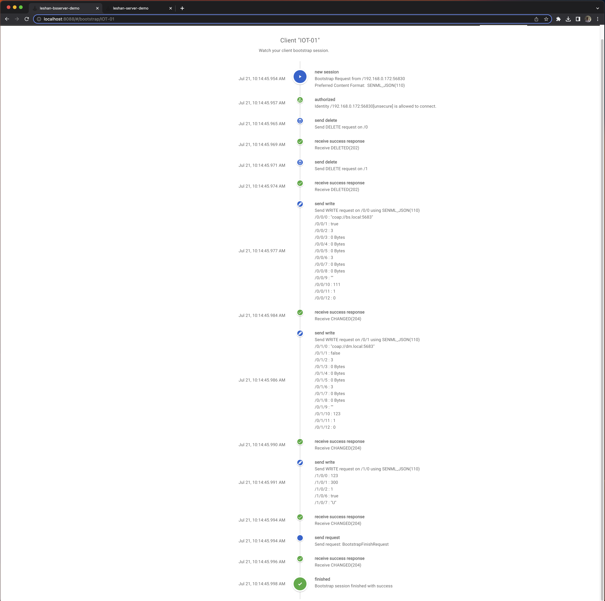
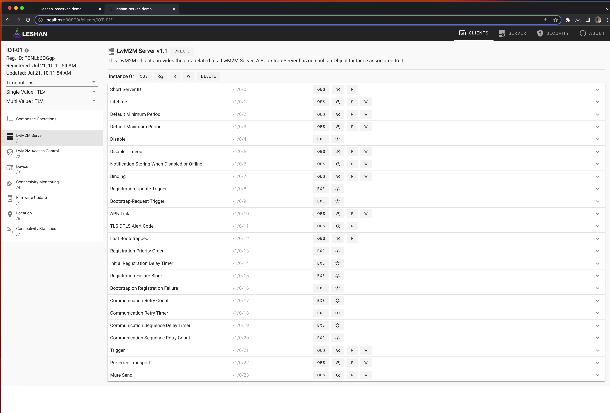

# Wakaama

Wakaama (formerly liblwm2m) is an implementation of the Open Mobile Alliance's LightWeight M2M
protocol (LWM2M).

Developers mailing list: https://dev.eclipse.org/mailman/listinfo/wakaama-dev

# Build wakaama and Testing out with Leshan for SouthEastWater

```
(base) henrynguyen@tits1003m13 client % ./lwm2mclient -n IOT-01 -h bs.local -p 5683 -4 -b
Trying to bind LWM2M Client to port 56830
LWM2M Client "IOT-01" started on port 56830
> Opening connection to server at bs.local:5683
 -> State: STATE_BOOTSTRAPPING
 -> State: STATE_BOOTSTRAPPING
8 bytes received from [192.168.0.172]:5683
64 44 16 C2  C2 16 49 CD   dD....I.
 -> State: STATE_BOOTSTRAPPING
14 bytes received from [192.168.0.172]:5683
48 04 0C 3F  48 74 91 77  A9 30 66 3A  B1 30  H..?Ht.w.0f:.0
 -> State: STATE_BOOTSTRAPPING
14 bytes received from [192.168.0.172]:5683
48 04 0C 40  7C AC 83 9D  9F E9 72 93  B1 31  H..@|.....r..1
 -> State: STATE_BOOTSTRAPPING
284 bytes received from [192.168.0.172]:5683
48 03 0C 41  C8 73 E9 2A  80 F6 23 A0  B1 30 01 30   H..A.s.*..#..0.0
11 6E FF 5B  7B 22 62 6E  22 3A 22 2F  30 2F 30 2F   .n.[{"bn":"/0/0/
22 2C 22 6E  22 3A 22 30  22 2C 22 76  73 22 3A 22   ","n":"0","vs":"
63 6F 61 70  3A 2F 2F 62  73 2E 6C 6F  63 61 6C 3A   coap://bs.local:
35 36 38 33  22 7D 2C 7B  22 6E 22 3A  22 31 22 2C   5683"},{"n":"1",
22 76 62 22  3A 74 72 75  65 7D 2C 7B  22 6E 22 3A   "vb":true},{"n":
22 32 22 2C  22 76 22 3A  33 7D 2C 7B  22 6E 22 3A   "2","v":3},{"n":
22 33 22 2C  22 76 64 22  3A 22 22 7D  2C 7B 22 6E   "3","vd":""},{"n
22 3A 22 34  22 2C 22 76  64 22 3A 22  22 7D 2C 7B   ":"4","vd":""},{
22 6E 22 3A  22 35 22 2C  22 76 64 22  3A 22 22 7D   "n":"5","vd":""}
2C 7B 22 6E  22 3A 22 36  22 2C 22 76  22 3A 33 7D   ,{"n":"6","v":3}
2C 7B 22 6E  22 3A 22 37  22 2C 22 76  64 22 3A 22   ,{"n":"7","vd":"
22 7D 2C 7B  22 6E 22 3A  22 38 22 2C  22 76 64 22   "},{"n":"8","vd"
3A 22 22 7D  2C 7B 22 6E  22 3A 22 39  22 2C 22 76   :""},{"n":"9","v
73 22 3A 22  22 7D 2C 7B  22 6E 22 3A  22 31 30 22   s":""},{"n":"10"
2C 22 76 22  3A 31 31 31  7D 2C 7B 22  6E 22 3A 22   ,"v":111},{"n":"
31 31 22 2C  22 76 22 3A  31 7D 2C 7B  22 6E 22 3A   11","v":1},{"n":
22 31 32 22  2C 22 76 22  3A 30 7D 5D                "12","v":0}]
 -> State: STATE_BOOTSTRAPPING
285 bytes received from [192.168.0.172]:5683
48 03 0C 42  B8 D1 23 01  75 D7 1A 05  B1 30 01 31   H..B..#.u....0.1
11 6E FF 5B  7B 22 62 6E  22 3A 22 2F  30 2F 31 2F   .n.[{"bn":"/0/1/
22 2C 22 6E  22 3A 22 30  22 2C 22 76  73 22 3A 22   ","n":"0","vs":"
63 6F 61 70  3A 2F 2F 64  6D 2E 6C 6F  63 61 6C 3A   coap://dm.local:
35 36 38 33  22 7D 2C 7B  22 6E 22 3A  22 31 22 2C   5683"},{"n":"1",
22 76 62 22  3A 66 61 6C  73 65 7D 2C  7B 22 6E 22   "vb":false},{"n"
3A 22 32 22  2C 22 76 22  3A 33 7D 2C  7B 22 6E 22   :"2","v":3},{"n"
3A 22 33 22  2C 22 76 64  22 3A 22 22  7D 2C 7B 22   :"3","vd":""},{"
6E 22 3A 22  34 22 2C 22  76 64 22 3A  22 22 7D 2C   n":"4","vd":""},
7B 22 6E 22  3A 22 35 22  2C 22 76 64  22 3A 22 22   {"n":"5","vd":""
7D 2C 7B 22  6E 22 3A 22  36 22 2C 22  76 22 3A 33   },{"n":"6","v":3
7D 2C 7B 22  6E 22 3A 22  37 22 2C 22  76 64 22 3A   },{"n":"7","vd":
22 22 7D 2C  7B 22 6E 22  3A 22 38 22  2C 22 76 64   ""},{"n":"8","vd
22 3A 22 22  7D 2C 7B 22  6E 22 3A 22  39 22 2C 22   ":""},{"n":"9","
76 73 22 3A  22 22 7D 2C  7B 22 6E 22  3A 22 31 30   vs":""},{"n":"10
22 2C 22 76  22 3A 31 32  33 7D 2C 7B  22 6E 22 3A   ","v":123},{"n":
22 31 31 22  2C 22 76 22  3A 31 7D 2C  7B 22 6E 22   "11","v":1},{"n"
3A 22 31 32  22 2C 22 76  22 3A 30 7D  5D            :"12","v":0}]
 -> State: STATE_BOOTSTRAPPING
124 bytes received from [192.168.0.172]:5683
48 03 0C 43  B8 86 91 FD  CC 6C 5A 5F  B1 31 01 30   H..C.....lZ_.1.0
11 6E FF 5B  7B 22 62 6E  22 3A 22 2F  31 2F 30 2F   .n.[{"bn":"/1/0/
22 2C 22 6E  22 3A 22 30  22 2C 22 76  22 3A 31 32   ","n":"0","v":12
33 7D 2C 7B  22 6E 22 3A  22 31 22 2C  22 76 22 3A   3},{"n":"1","v":
33 30 30 7D  2C 7B 22 6E  22 3A 22 32  22 2C 22 76   300},{"n":"2","v
22 3A 31 7D  2C 7B 22 6E  22 3A 22 36  22 2C 22 76   ":1},{"n":"6","v
62 22 3A 74  72 75 65 7D  2C 7B 22 6E  22 3A 22 37   b":true},{"n":"7
22 2C 22 76  73 22 3A 22  55 22 7D 5D                ","vs":"U"}]
 -> State: STATE_BOOTSTRAPPING
15 bytes received from [192.168.0.172]:5683
48 02 0C 44  F4 49 4F 1F  3C 04 A8 0F  B2 62 73  H..D.IO.<....bs
 -> State: STATE_BOOTSTRAPPING
Opening connection to server at dm.local:5683
 -> State: STATE_REGISTERING
22 bytes received from [192.168.0.170]:5683
64 41 16 C3  C3 16 4A CD  82 72 64 0A  50 42 4E 4C   dA....J..rd.PBNL
62 36 4F 47  67 70                                   b6OGgp
 -> State: STATE_READY
 -> State: STATE_READY
 -> State: STATE_READY
^C%                                                                                                                                                                    (base) henrynguyen@tits1003m13 client % ./lwm2mclient -n IOT-01 -h bs.local -p 5683 -4 -b
Trying to bind LWM2M Client to port 56830
LWM2M Client "IOT-01" started on port 56830
> Opening connection to server at bs.local:5683
 -> State: STATE_BOOTSTRAPPING
 -> State: STATE_BOOTSTRAPPING
8 bytes received from [192.168.0.172]:5683
64 44 32 F6  F6 32 F5 CD   dD2..2..
 -> State: STATE_BOOTSTRAPPING
14 bytes received from [192.168.0.172]:5683
48 04 0C 45  6C 87 80 2F  37 C6 70 96  B1 30  H..El../7.p..0
 -> State: STATE_BOOTSTRAPPING
14 bytes received from [192.168.0.172]:5683
48 04 0C 46  AC C5 CE B9  EF 8A 85 DD  B1 31  H..F.........1
 -> State: STATE_BOOTSTRAPPING
284 bytes received from [192.168.0.172]:5683
48 03 0C 47  24 FF 5C 35  83 A4 A7 36  B1 30 01 30   H..G$.\5...6.0.0
11 6E FF 5B  7B 22 62 6E  22 3A 22 2F  30 2F 30 2F   .n.[{"bn":"/0/0/
22 2C 22 6E  22 3A 22 30  22 2C 22 76  73 22 3A 22   ","n":"0","vs":"
63 6F 61 70  3A 2F 2F 62  73 2E 6C 6F  63 61 6C 3A   coap://bs.local:
35 36 38 33  22 7D 2C 7B  22 6E 22 3A  22 31 22 2C   5683"},{"n":"1",
22 76 62 22  3A 74 72 75  65 7D 2C 7B  22 6E 22 3A   "vb":true},{"n":
22 32 22 2C  22 76 22 3A  33 7D 2C 7B  22 6E 22 3A   "2","v":3},{"n":
22 33 22 2C  22 76 64 22  3A 22 22 7D  2C 7B 22 6E   "3","vd":""},{"n
22 3A 22 34  22 2C 22 76  64 22 3A 22  22 7D 2C 7B   ":"4","vd":""},{
22 6E 22 3A  22 35 22 2C  22 76 64 22  3A 22 22 7D   "n":"5","vd":""}
2C 7B 22 6E  22 3A 22 36  22 2C 22 76  22 3A 33 7D   ,{"n":"6","v":3}
2C 7B 22 6E  22 3A 22 37  22 2C 22 76  64 22 3A 22   ,{"n":"7","vd":"
22 7D 2C 7B  22 6E 22 3A  22 38 22 2C  22 76 64 22   "},{"n":"8","vd"
3A 22 22 7D  2C 7B 22 6E  22 3A 22 39  22 2C 22 76   :""},{"n":"9","v
73 22 3A 22  22 7D 2C 7B  22 6E 22 3A  22 31 30 22   s":""},{"n":"10"
2C 22 76 22  3A 31 31 31  7D 2C 7B 22  6E 22 3A 22   ,"v":111},{"n":"
31 31 22 2C  22 76 22 3A  31 7D 2C 7B  22 6E 22 3A   11","v":1},{"n":
22 31 32 22  2C 22 76 22  3A 30 7D 5D                "12","v":0}]
 -> State: STATE_BOOTSTRAPPING
285 bytes received from [192.168.0.172]:5683
48 03 0C 48  F8 C4 02 92  72 FC E2 34  B1 30 01 31   H..H....r..4.0.1
11 6E FF 5B  7B 22 62 6E  22 3A 22 2F  30 2F 31 2F   .n.[{"bn":"/0/1/
22 2C 22 6E  22 3A 22 30  22 2C 22 76  73 22 3A 22   ","n":"0","vs":"
63 6F 61 70  3A 2F 2F 64  6D 2E 6C 6F  63 61 6C 3A   coap://dm.local:
35 36 38 33  22 7D 2C 7B  22 6E 22 3A  22 31 22 2C   5683"},{"n":"1",
22 76 62 22  3A 66 61 6C  73 65 7D 2C  7B 22 6E 22   "vb":false},{"n"
3A 22 32 22  2C 22 76 22  3A 33 7D 2C  7B 22 6E 22   :"2","v":3},{"n"
3A 22 33 22  2C 22 76 64  22 3A 22 22  7D 2C 7B 22   :"3","vd":""},{"
6E 22 3A 22  34 22 2C 22  76 64 22 3A  22 22 7D 2C   n":"4","vd":""},
7B 22 6E 22  3A 22 35 22  2C 22 76 64  22 3A 22 22   {"n":"5","vd":""
7D 2C 7B 22  6E 22 3A 22  36 22 2C 22  76 22 3A 33   },{"n":"6","v":3
7D 2C 7B 22  6E 22 3A 22  37 22 2C 22  76 64 22 3A   },{"n":"7","vd":
22 22 7D 2C  7B 22 6E 22  3A 22 38 22  2C 22 76 64   ""},{"n":"8","vd
22 3A 22 22  7D 2C 7B 22  6E 22 3A 22  39 22 2C 22   ":""},{"n":"9","
76 73 22 3A  22 22 7D 2C  7B 22 6E 22  3A 22 31 30   vs":""},{"n":"10
22 2C 22 76  22 3A 31 32  33 7D 2C 7B  22 6E 22 3A   ","v":123},{"n":
22 31 31 22  2C 22 76 22  3A 31 7D 2C  7B 22 6E 22   "11","v":1},{"n"
3A 22 31 32  22 2C 22 76  22 3A 30 7D  5D            :"12","v":0}]
 -> State: STATE_BOOTSTRAPPING
124 bytes received from [192.168.0.172]:5683
48 03 0C 49  7C 18 42 89  F5 98 0E AF  B1 31 01 30   H..I|.B......1.0
11 6E FF 5B  7B 22 62 6E  22 3A 22 2F  31 2F 30 2F   .n.[{"bn":"/1/0/
22 2C 22 6E  22 3A 22 30  22 2C 22 76  22 3A 31 32   ","n":"0","v":12
33 7D 2C 7B  22 6E 22 3A  22 31 22 2C  22 76 22 3A   3},{"n":"1","v":
33 30 30 7D  2C 7B 22 6E  22 3A 22 32  22 2C 22 76   300},{"n":"2","v
22 3A 31 7D  2C 7B 22 6E  22 3A 22 36  22 2C 22 76   ":1},{"n":"6","v
62 22 3A 74  72 75 65 7D  2C 7B 22 6E  22 3A 22 37   b":true},{"n":"7
22 2C 22 76  73 22 3A 22  55 22 7D 5D                ","vs":"U"}]
 -> State: STATE_BOOTSTRAPPING
15 bytes received from [192.168.0.172]:5683
48 02 0C 4A  00 B3 AF 6A  5F A9 62 92  B2 62 73  H..J...j_.b..bs
 -> State: STATE_BOOTSTRAPPING
Opening connection to server at dm.local:5683
 -> State: STATE_REGISTERING
22 bytes received from [192.168.0.170]:5683
64 41 32 F7  F7 32 F5 CD  82 72 64 0A  54 56 48 52   dA2..2...rd.TVHR
67 33 58 66  42 51                                   g3XfBQ
 -> State: STATE_READY
 -> State: STATE_READY
 -> State: STATE_READY
 -> State: STATE_READY
 -> State: STATE_READY
8 bytes received from [192.168.0.170]:5683

```




## Security warning

The only official release of Wakaama, version 1.0, is affected by various
security issues ([CVE-2019-9004], [CVE-2021-41040]).

Please use the most recent commit in the master branch. Release 1.0 is not
supported anymore.

[CVE-2019-9004]: https://www.cve.org/CVERecord?id=CVE-2019-9004
[CVE-2021-41040]: https://www.cve.org/CVERecord?id=CVE-2021-41040

## Badges
[](https://github.com/eclipse/wakaama/actions/workflows/build_and_test.yaml)

## Source Layout

    -+- core                   (the LWM2M engine)
     |
     +- coap                   (CoAP stack adaptation)
     |    |
     |    +- er-coap-13        (Modified Erbium's CoAP engine from
     |                          https://web.archive.org/web/20180316172739/http://people.inf.ethz.ch/mkovatsc/erbium.php)
     |
     +- data                   (data formats serialization/deserialization)
     |
     +- tests                  (test cases)
     |    |
     |    +- integration       (pytest based integration tests implementing the OMA-ETS-LightweightM2M-V1_1-20190912-D specification
     |                          https://www.openmobilealliance.org/release/LightweightM2M/ETS/OMA-ETS-LightweightM2M-V1_1-20190912-D.pdf)
     +- examples
          |
          +- bootstrap_server  (a command-line LWM2M bootstrap server)
          |
          +- client            (a command-line LWM2M client with several test objects)
          |
          +- lightclient       (a very simple command-line LWM2M client with several test objects)
          |
          +- server            (a command-line LWM2M server)
          |
          +- shared            (utility functions for connection handling and command-
                                line interface)

## Checking out the code

### Using Wakaama as library

```
git clone https://github.com/eclipse/wakaama.git
```

### Working on Wakaama

When working on Wakaama itself, or intending to run the example client application, submodules must be checked out:

```
git clone --recurse-submodules https://github.com/eclipse/wakaama.git
```

## Compiling

Wakaama is not a library but files to be built with an application.
Wakaama uses CMake >= 3.13. Look at examples/server/CMakeLists.txt for an
example of how to include it.
Several preprocessor definitions are supported:
 - Endianness: Exactly one has to be defined.
   - LWM2M_BIG_ENDIAN if your target platform uses big-endian format.
   - LWM2M_LITTLE_ENDIAN if your target platform uses little-endian format.
 - Mode: One or multiple modes have to be defined.
   - LWM2M_CLIENT_MODE to enable LWM2M Client interfaces.
   - LWM2M_SERVER_MODE to enable LWM2M Server interfaces.
   - LWM2M_BOOTSTRAP_SERVER_MODE to enable LWM2M Bootstrap Server interfaces.
 - LWM2M_BOOTSTRAP to enable LWM2M Bootstrap support in a LWM2M Client.
 - LWM2M_SUPPORT_TLV to enable TLV payload support (implicit except for LWM2M 1.1 clients)
 - LWM2M_SUPPORT_JSON to enable JSON payload support (implicit when defining LWM2M_SERVER_MODE)
 - LWM2M_SUPPORT_SENML_JSON to enable SenML JSON payload support (implicit for LWM2M 1.1 or greater when defining LWM2M_SERVER_MODE or LWM2M_BOOTSTRAP_SERVER_MODE)
 - LWM2M_OLD_CONTENT_FORMAT_SUPPORT to support the deprecated content format values for TLV and JSON.
 - Version 1.1 of LWM2M is supported per default, but can be constrained to older versions:
   - LWM2M_VERSION_1_0 to support only version 1.0
   Please note: Clients support only the specified version, while servers are backward compatible.
 - LWM2M_RAW_BLOCK1_REQUESTS For low memory client devices where it is not possible to keep a large post or put request in memory to be parsed (typically a firmware write).
   This option enable each unprocessed block 1 payload to be passed to the application, typically to be stored to a flash memory. 
 - LWM2M_COAP_DEFAULT_BLOCK_SIZE CoAP block size used by CoAP layer when performing block-wise transfers. Possible values: 16, 32, 64, 128, 256, 512 and 1024. Defaults to 1024.

## Development

### Dependencies and Tools
- Mandatory:
  - Compiler: GCC and/or Clang
- Optional (but strongly recommended):
  - Build system generator: CMake 3.13+
  - Version control system: Git (and a GitHub account)
  - Git commit message linter: gitlint
  - Build system: ninja
  - C code formatting: clang-format, version 14
  - CMake list files formatting: cmake-format, version 0.6.13
  - Unit testing: CUnit

On Ubuntu 20.04, used in CI, the dependencies can be installed as such:
- `apt install build-essential clang-format clang-format-14 clang-tools-14 cmake gcovr git libcunit1-dev ninja-build python3-pip`
- `pip3 install -r tools/requirements-compliance.txt`

### Code formatting
#### C
New C code must be formatted with [clang-format](https://clang.llvm.org/docs/ClangFormat.html).

The style is based on the LLVM style, but with 4 instead of 2 spaces indentation and allowing for 120 instead of 80
characters per line.

To check if your code matches the expected style, the following commands are helpful:
 - `git clang-format-14 --diff`: Show what needs to be changed to match the expected code style
 - `git clang-format-14`: Apply all needed changes directly
 - `git clang-format-14 --commit master`: Fix code style for all changes since master

If existing code gets reformatted, this must be done in a separate commit. Its commit id has to be added to the file
`.git-blame-ignore-revs` and committed in yet another commit.

#### CMake
All CMake code must be formatted with [cmake-format](https://github.com/cheshirekow/cmake_format).

To check if your code matches the expected style, the following commands are helpful:
 - `tools/ci/run_ci.sh --run-cmake-format`: Test all CMake files, print offending ones
 - `cmake-format --in-place <unformatted-file>`: Apply all needed changes directly to <unformatted-file>

### Running CI tests locally
To avoid unneeded load on the GitHub infrastructure, please consider running `tools/ci/run_ci.sh --all` before pushing.

### Running integration tests locally
```
cd wakaama
tools/ci/run_ci.sh --run-build
pytest -v tests/integration
```

## Examples

There are some example applications provided to test the server, client and bootstrap capabilities of Wakaama.
The following recipes assume you are on a unix like platform and you have cmake and make installed.

### Server example
 * Create a build directory and change to that.
 * ``cmake [wakaama directory]/examples/server``
 * ``make``
 * ``./lwm2mserver [Options]``

The lwm2mserver listens on UDP port 5683. It features a basic command line
interface. Type 'help' for a list of supported commands.

Options are:
```
Usage: lwm2mserver [OPTION]
Launch a LWM2M server on localhost.

Options:
  -4		Use IPv4 connection. Default: IPv6 connection
  -l PORT	Set the local UDP port of the Server. Default: 5683
  -S BYTES	CoAP block size. Options: 16, 32, 64, 128, 256, 512, 1024. Default: 1024
```

### Test client example
 * Create a build directory and change to that.
 * ``cmake [wakaama directory]/examples/client``
 * ``make``
 * ``./lwm2mclient [Options]``

Next to lwm2mclient a DTLS enabled variant named lwm2mclient_tinydtls gets built.

The lwm2mclient features nine LWM2M objects:
 - Security Object (id: 0)
 - Server Object (id: 1)
 - Access Control Object (id: 2) as a skeleton
 - Device Object (id: 3) containing hard-coded values from the Example LWM2M
 Client of Appendix E of the LWM2M Technical Specification.
 - Connectivity Monitoring Object (id: 4) as a skeleton
 - Firmware Update Object (id: 5) as a skeleton.
 - Location Object (id: 6) as a skeleton.
 - Connectivity Statistics Object (id: 7) as a skeleton.
 - Test Object (id: 31024) with the following description:

                           Multiple
          Object |  ID   | Instances | Mandatory |
           Test  | 31024 |    Yes    |    No     |

           Resources:
                       Supported    Multiple
           Name | ID | Operations | Instances | Mandatory |  Type   | Range |
           test |  1 |    R/W     |    No     |    Yes    | Integer | 0-255 |
           exec |  2 |     E      |    No     |    Yes    |         |       |
           dec  |  3 |    R/W     |    No     |    Yes    |  Float  |       |

The lwm2mclient opens UDP port 56830 and tries to register to a LWM2M Server at
127.0.0.1:5683. It features a basic command line interface. Type 'help' for a
list of supported commands.

Options are:
```
Usage: lwm2mclient [OPTION]
Launch a LWM2M client.
Options:
  -n NAME	Set the endpoint name of the Client. Default: testlwm2mclient
  -l PORT	Set the local UDP port of the Client. Default: 56830
  -h HOST	Set the hostname of the LWM2M Server to connect to. Default: localhost
  -p PORT	Set the port of the LWM2M Server to connect to. Default: 5683
  -4		Use IPv4 connection. Default: IPv6 connection
  -t TIME	Set the lifetime of the Client. Default: 300
  -b		Bootstrap requested.
  -c		Change battery level over time.
  -S BYTES	CoAP block size. Options: 16, 32, 64, 128, 256, 512, 1024. Default: 1024

```

Additional values for the lwm2mclient_tinydtls binary:
```
  -i Set the device management or bootstrap server PSK identity. If not set use none secure mode
  -s Set the device management or bootstrap server Pre-Shared-Key. If not set use none secure mode
```

To launch a bootstrap session:
``./lwm2mclient -b``

### Simpler test client example

In the any directory, run the following commands:
 * Create a build directory and change to that.
 * ``cmake [wakaama directory]/examples/lightclient``
 * ``make``
 * ``./lightclient [Options]``

The lightclient is much simpler that the lwm2mclient and features only four
LWM2M objects:
 - Security Object (id: 0)
 - Server Object (id: 1)
 - Device Object (id: 3) containing hard-coded values from the Example LWM2M
 Client of Appendix E of the LWM2M Technical Specification.
 - Test Object (id: 31024) from the lwm2mclient as described above.

The lightclient does not feature any command-line interface.

Options are:
```
Usage: lwm2mclient [OPTION]
Launch a LWM2M client.
Options:
  -n NAME	Set the endpoint name of the Client. Default: testlightclient
  -l PORT	Set the local UDP port of the Client. Default: 56830
  -4		Use IPv4 connection. Default: IPv6 connection
  -S BYTES	CoAP block size. Options: 16, 32, 64, 128, 256, 512, 1024. Default: 1024
```
### Bootstrap Server example
 * Create a build directory and change to that.
 * ``cmake [wakaama directory]/examples/bootstrap_server``
 * ``make``
 * ``./bootstrap_server [Options]``

Refer to [examples/bootstrap_server/README](./examples/bootstrap_server/README) for more information.
